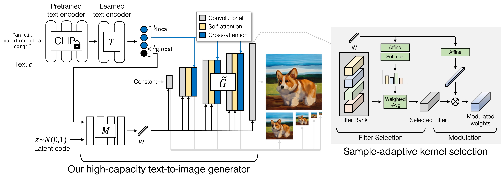
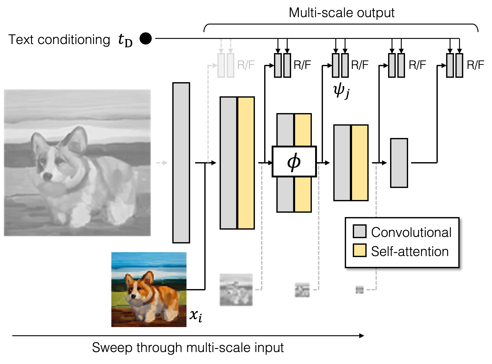

# GigaGAN

</img>
> 1B-parameter GigaGAN, achieving lower FID than Stable Diffusion v1.5, DALL·E 2, and Parti-750M. Please reference: https://doi.org/10.48550/arxiv.2303.05511


## GigaGAN generator
</img>

## GigaGAN discriminator
</img>

## GigaGAN

Implementation of <a href="https://arxiv.org/abs/2303.05511">GigaGAN</a> <a href="https://mingukkang.github.io/GigaGAN/">(project page)</a>, new SOTA GAN out of  Stable Diffusion v1.5, DALL·E 2.

## Citations

```bibtex
@misc{https://doi.org/10.48550/arxiv.2303.05511,
    url     = {https://arxiv.org/abs/2303.05511},
    author  = {Kang, Minguk and Zhu, Jun-Yan and Zhang, Richard and Park, Jaesik and Shechtman, Eli and Paris, Sylvain and Park, Taesung},
    title   = {Scaling up GANs for Text-to-Image Synthesis},
    publisher = {arXiv},
    year    = {2023},
    copyright = {arXiv.org perpetual, non-exclusive license}
}
```
